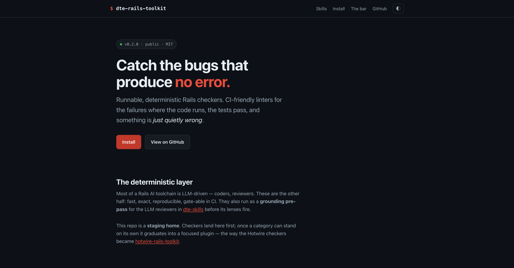

# dte-rails-toolkit

[](https://davidteren.github.io/dte-rails-toolkit/)
[](./LICENSE)
[](https://docs.claude.com/en/docs/claude-code)
[](#skills)
[](#how-its-built-the-bar-for-adding-a-checker)

[](https://davidteren.github.io/dte-rails-toolkit/)

**A general-purpose toolkit of runnable, deterministic Rails checkers** — CI-friendly
linters that catch the failures that produce *no error* (the code runs, the tests pass,
something is just quietly wrong).

This repo is a **staging home**. Individual checkers and skills land here first; once a
category has enough to stand on its own, it graduates into a focused plugin — the way the
Hotwire checkers became [hotwire-rails-toolkit](https://github.com/davidteren/hotwire-rails-toolkit).
The rest of a typical Rails AI toolchain is LLM-driven (coders, reviewers); these are the
**deterministic** layer — fast, exact, reproducible, gate-able in CI, and a grounding
pre-pass for the LLM reviewers (e.g. [dte-skills](https://github.com/davidteren/dte-skills)
runs them before its lenses).

## Skills

| Skill | Catches | Ships |
|---|---|---|
| **layer-boundary-lint** | Rails **layering violations** the architecture books describe but no tool gates: `Current.` read in models, `request`/`params` in the domain layer (services **and** interactors), raw `.where/.order/.joins` in controllers/views, mailer/HTTP I/O in `after_*` callbacks, off-layer `Current` writes, oversized `Current` | `lint_layer_boundaries.sh` (bash + python3) · reference guide |
| **rails-test-smell-checker** | **test smells** (Minitest **and** RSpec): `sleep` in system tests, missing `WebMock.disable_net_connect!`, stubbing the SUT, `has_css?`/`has_content?` inside an assertion, plus caveated heuristics (Mystery Guest) | `lint_test_smells.sh` (python3) · reference guide |
| **rails-n1-guardrail-check** | **N+1 defenses**: no `strict_loading`/detection gem wired, `.count` on an association in views/loops, relation-breakers (`.order/.first/.pluck`) inside `.each`. Asserts guardrails *exist* — not a general detector (Bullet/Prosopite own that) | `lint_n1_guardrails.sh` (bash + python3) · reference guide |
| **rails-csv-io** | **CSV import/export footguns**: whole-file `CSV.read` (memory), missing `encoding:`/BOM, bang-persist in a row loop with no transaction + no per-row error reporting | `lint_csv_io.sh` (bash + python3) · guide + streaming template |
| **cable-stream-security** | **ActionCable / Turbo-Stream hardening**: `stream_from` without authorizing/`reject`, `constantize` on client `params`/`dataset`, missing `allowed_request_origins`, absent CSP `connect-src` | `lint_cable_security.sh` (bash + python3) · reference guide |

## Using it

**As tools** — the scripts run standalone against any Rails app; each exits non-zero on
findings (CI-friendly) and names its own ceiling:

```bash
skills/layer-boundary-lint/scripts/lint_layer_boundaries.sh      path/to/rails-app
skills/rails-test-smell-checker/scripts/lint_test_smells.sh      path/to/rails-app
```

`layer-boundary-lint`: rules are individually skippable by label; `STRICT=1` fails on
advisories; `CURRENT_ATTR_MAX` tunes the Current-size threshold.
`rails-test-smell-checker`: high-confidence smells fail; heuristics are caveated and only
fail under `--strict`.

**As a Claude Code plugin:**

```bash
claude plugin marketplace add davidteren/dte-rails-toolkit
claude plugin install dte-rails-toolkit@dte-rails-toolkit-marketplace
```

## How it's built (the bar for adding a checker)

- **Deterministic, names its ceiling.** Heuristic text/AST scans, not full parsers — each
  script says so. A clean run is a gate, not a proof.
- **Verified both ways.** Every checker is run against a **real** app (must be truthful —
  no false positives) **and** a **synthetic broken case** (must flag it) before shipping.
- **False positives are the failure mode.** When a rule can't be made high-confidence
  cheaply, it's demoted to a caveated heuristic or dropped — not shipped loose.

Distilled from a review of Rails reference books (palkan's *Layered Design for Rails*,
thoughtbot's *Testing Rails*); the analysis that selected them lives in the
[Rails skills analysis](https://github.com/davidteren/dte-skills) lineage.

## License

MIT — see [LICENSE](./LICENSE).
